# CST8921 Lab 2
## finding and selecting the built-in "Allowed locations" policy
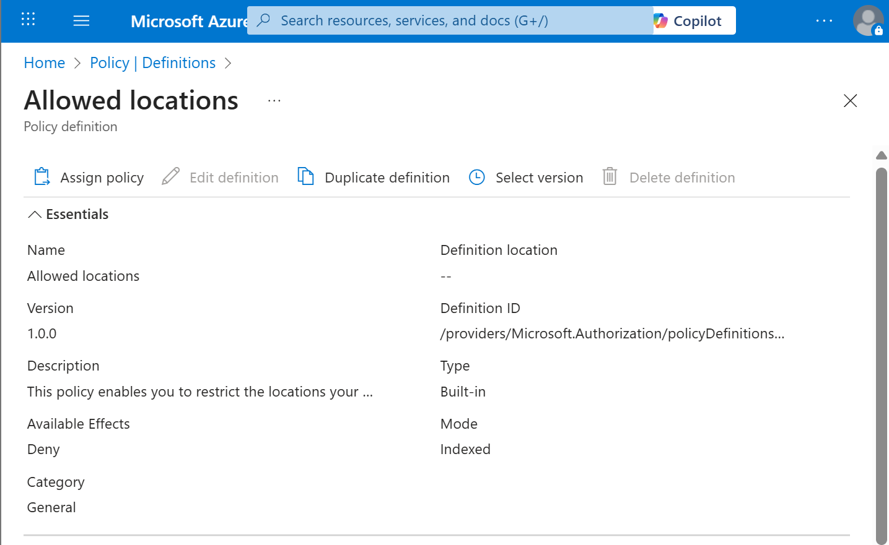

## Specifying the Scope of the policy
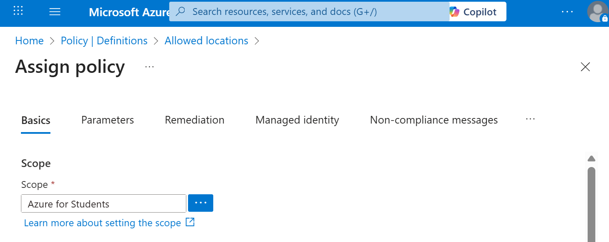

## Specifying Canada Central as the only allowed location
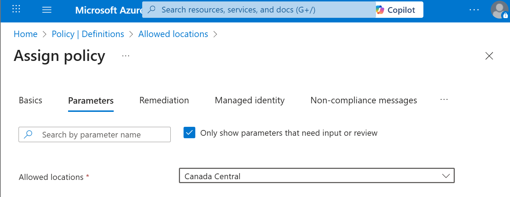

## Validating that the Policy is working
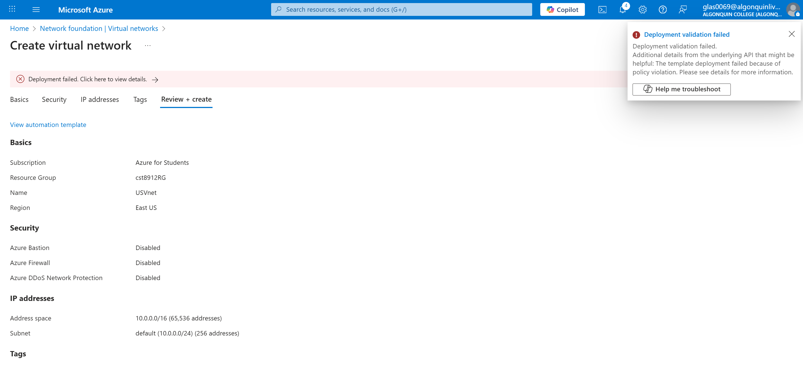

## Creating a VNet in Canada Central
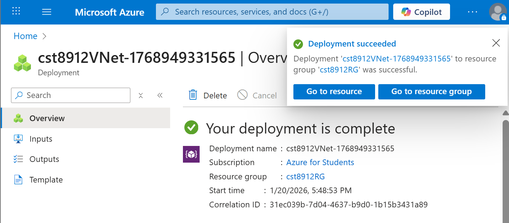

## Creating a private subnet with a service endpoint to Microsoft.Storage
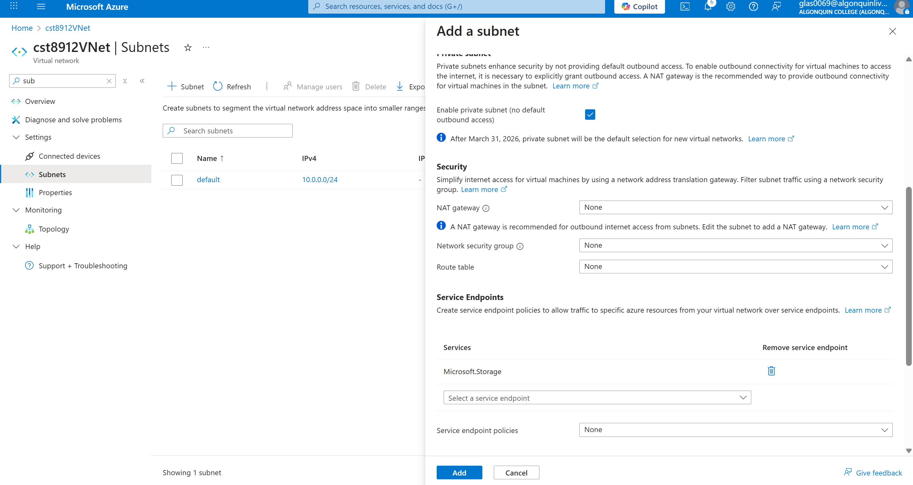

## Creating a public subnet
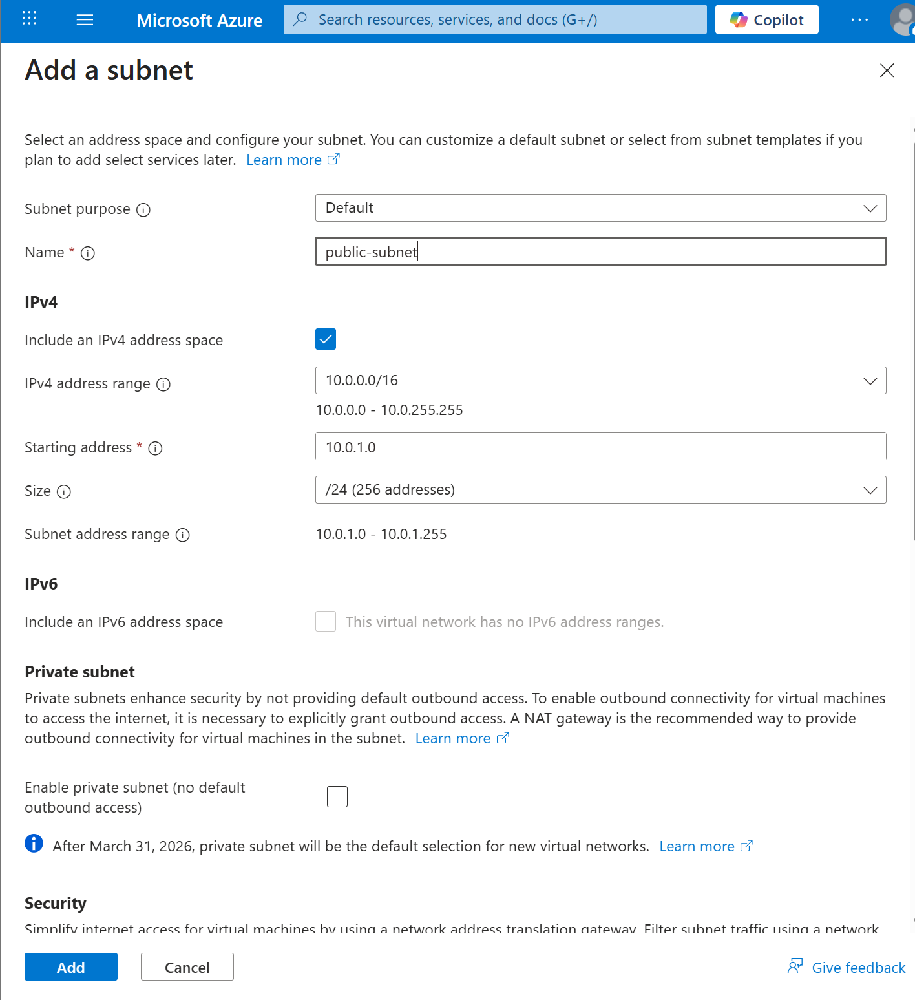

## Associating private-subnet to the Network Security Group
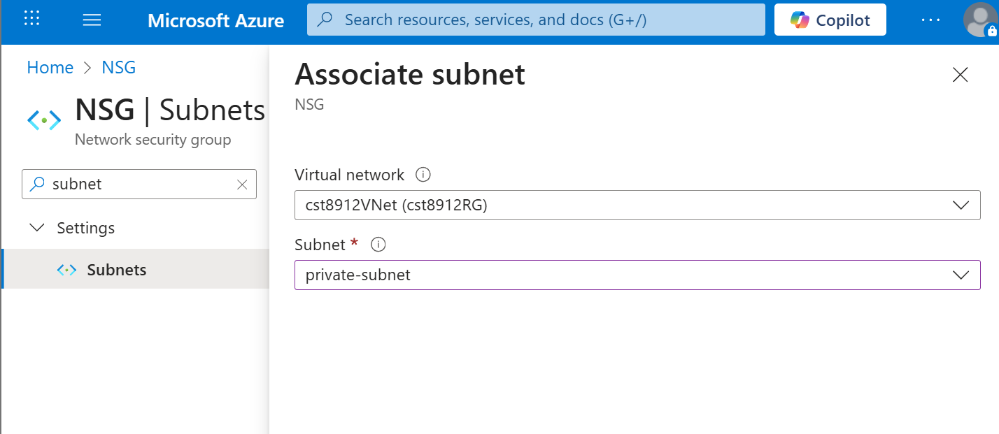

## Adding an outbound security rule to allow Azure 
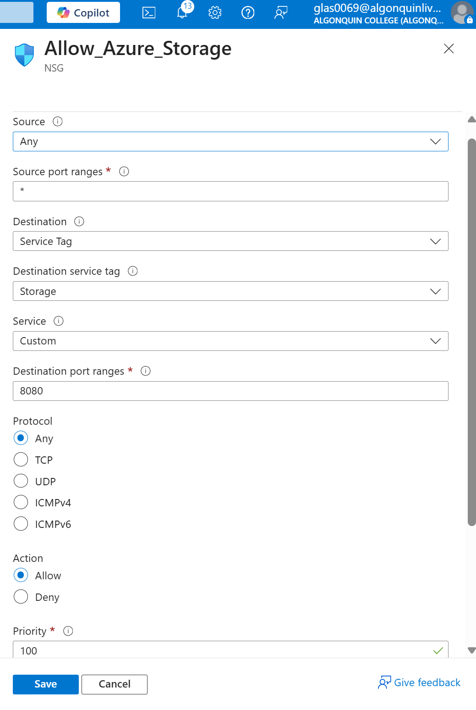

## Adding an outbound security rule to deny internet access. 
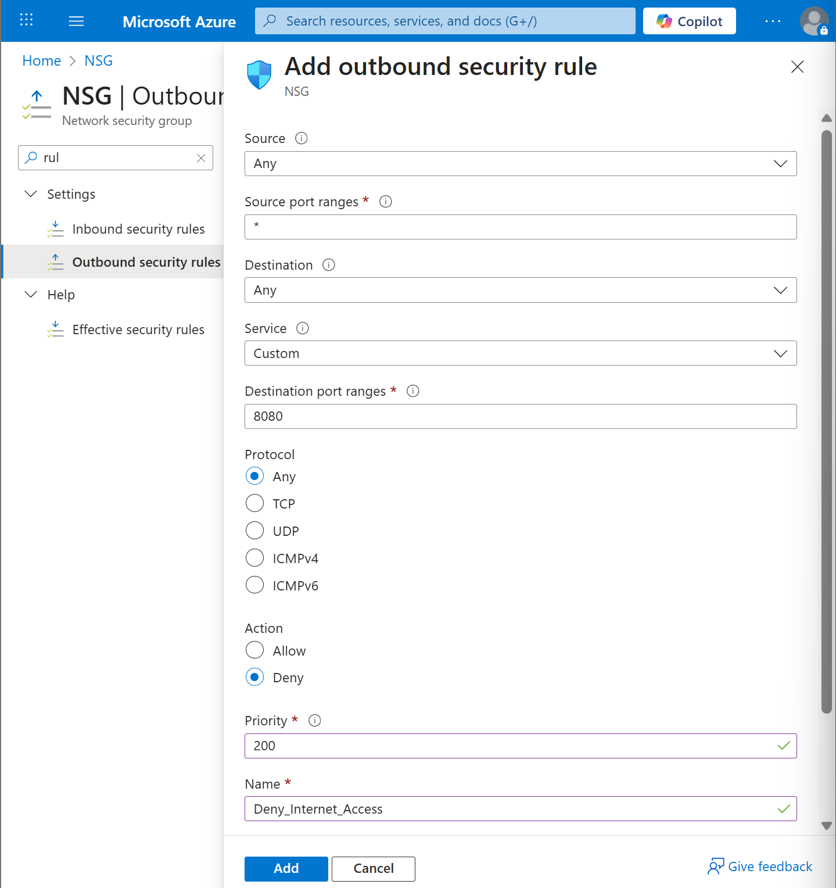

## Adding an inbound security rule to allow RDP
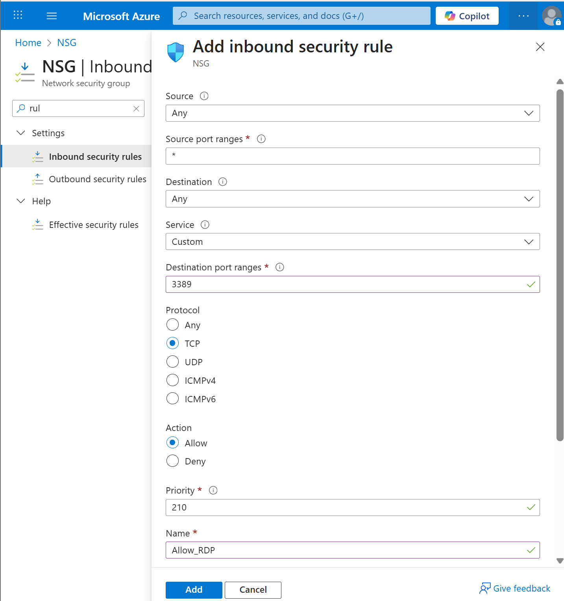

## Creating a storage account and ensuring that network access is restricted to private-subnet.
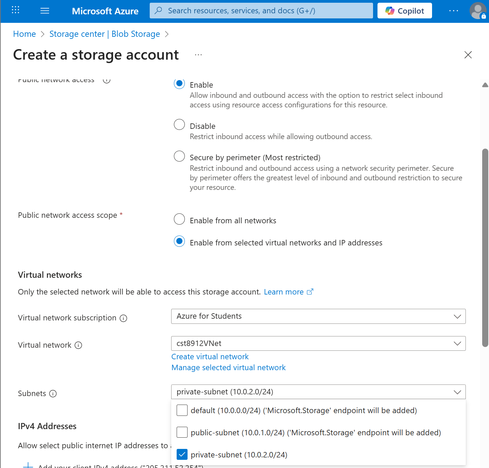
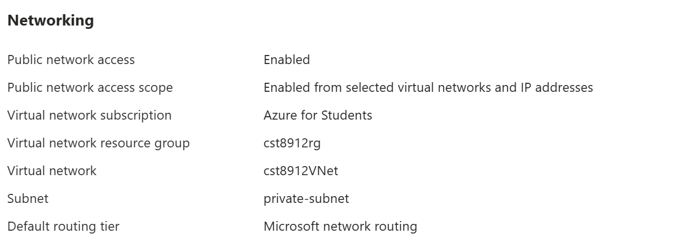

## Blocked from creating fileshare
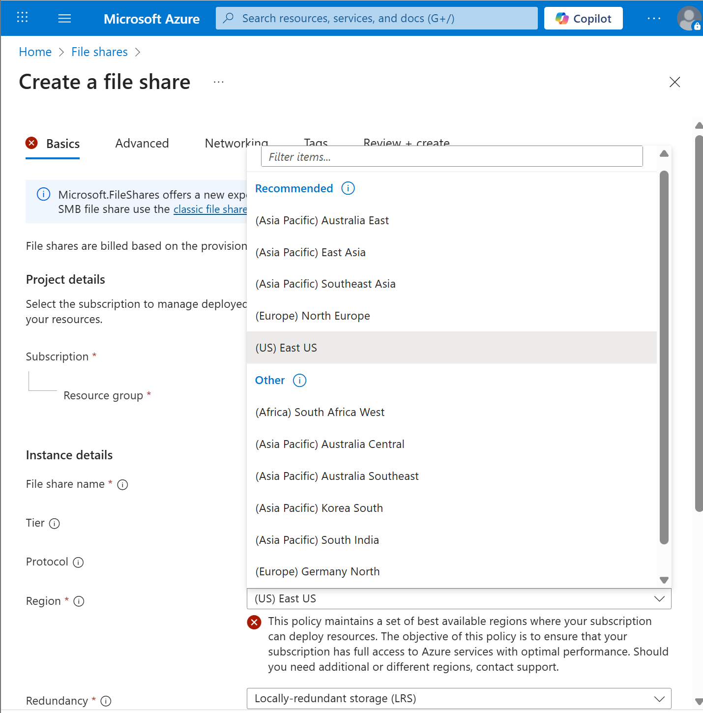
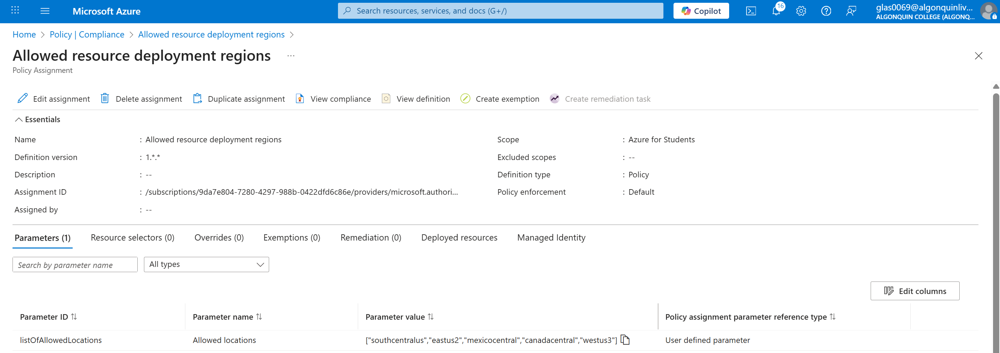
The regions which offer file share exclude the regions that I have access to with my Azure Student subscription. As a result, I cannot create a file share, meaning I cannot complete this lab at this time.

## Deleting Resources
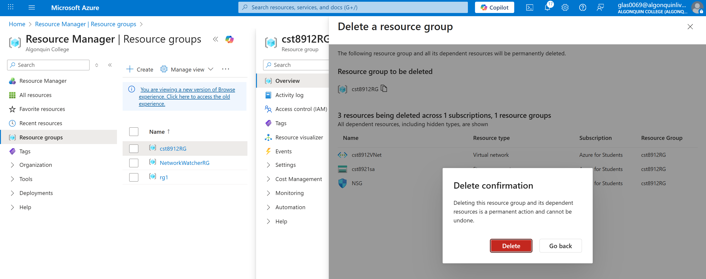
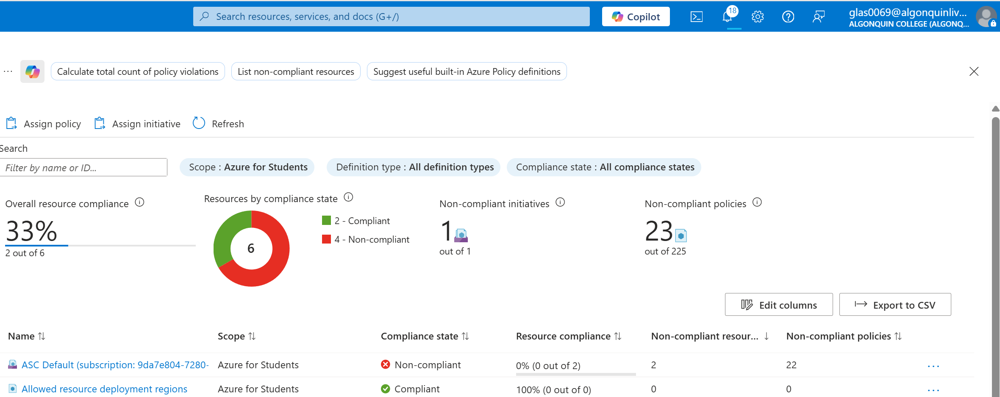