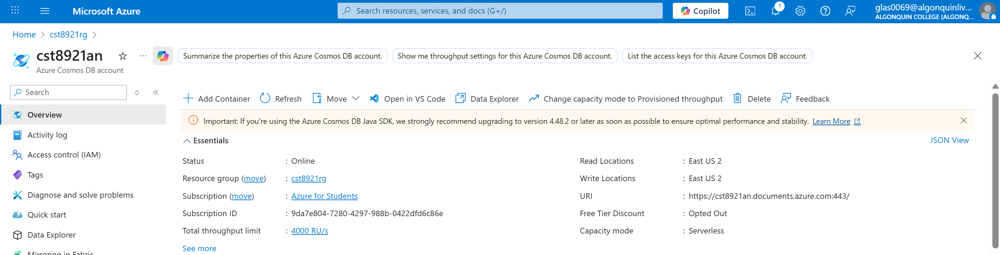
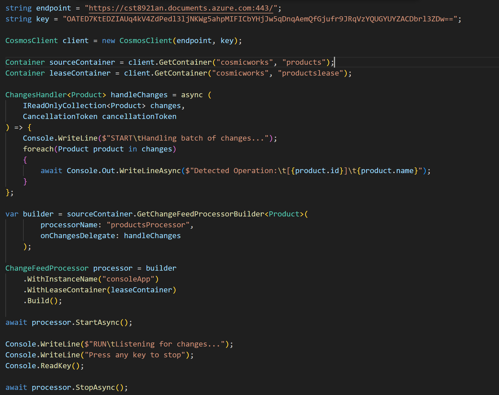
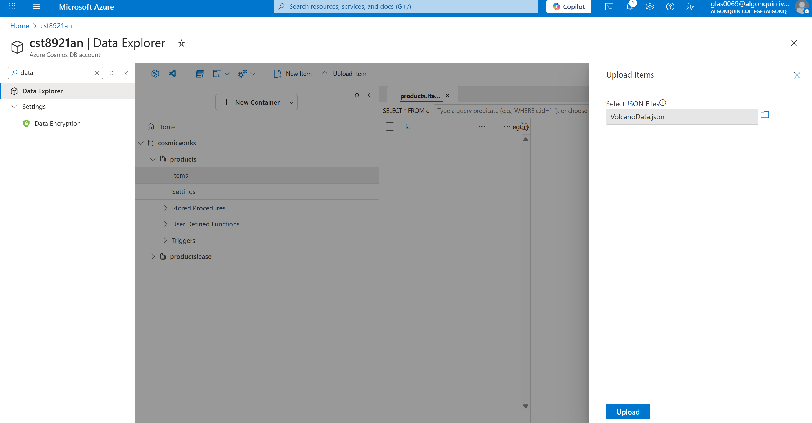
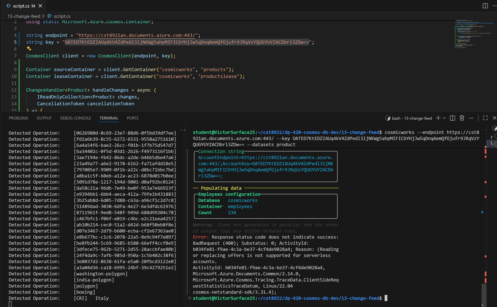
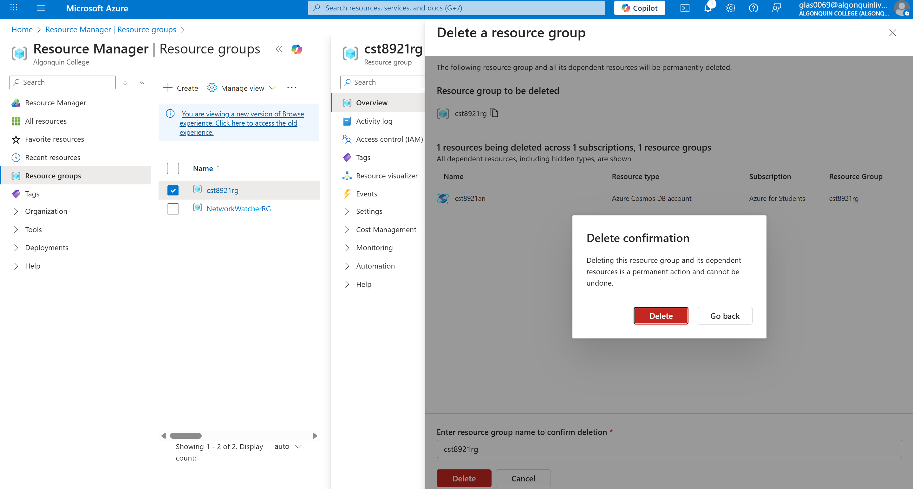

# Lab 3
## Created the Cosmos DB account

## Updated script.cs

## Importing sample data to container

## Error

The error explains that reading
and replacing offers is not supported for serverless 
accounts. This is due to account settings which are out of our control.
## Deleted resources
