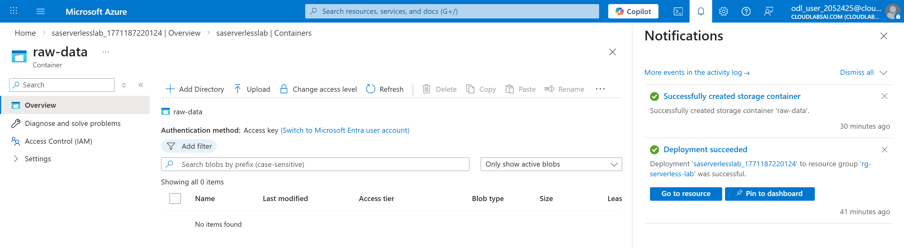

# Lab 5 – Serverless Computing
## Created Storage Account with Blob Container

## Created Function App

## Created Function

## Created Event Subscription

## Updated Function Code

## Verified Function Settings

## Created Sample Data File

## Uploaded File

## Confirmed Function Invocation

## Viewed Logs

## Cleaned up resources