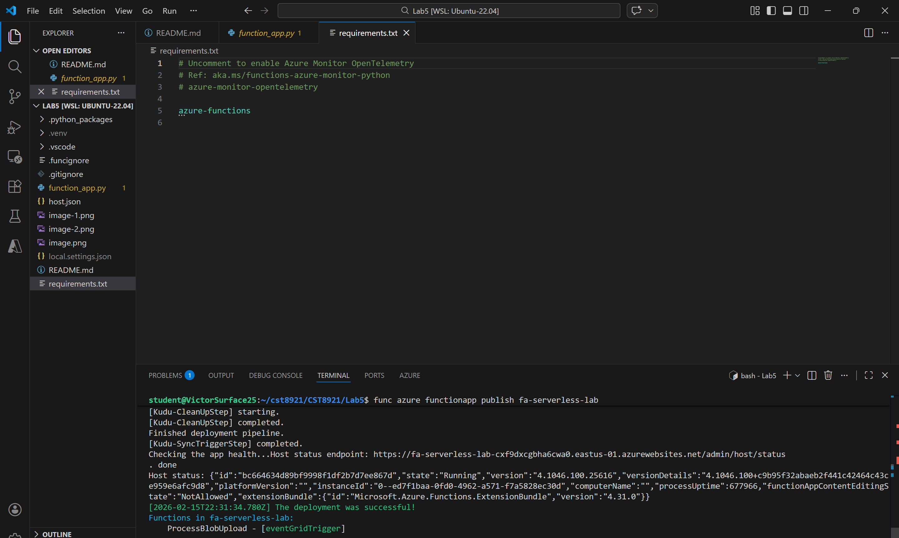
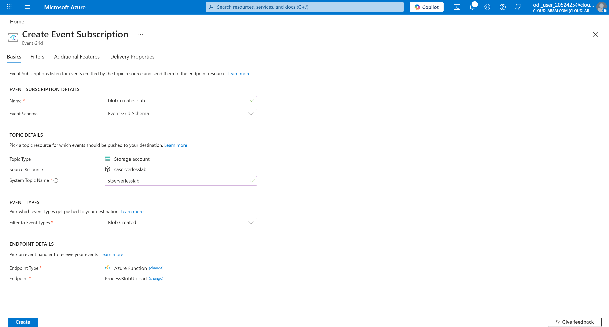
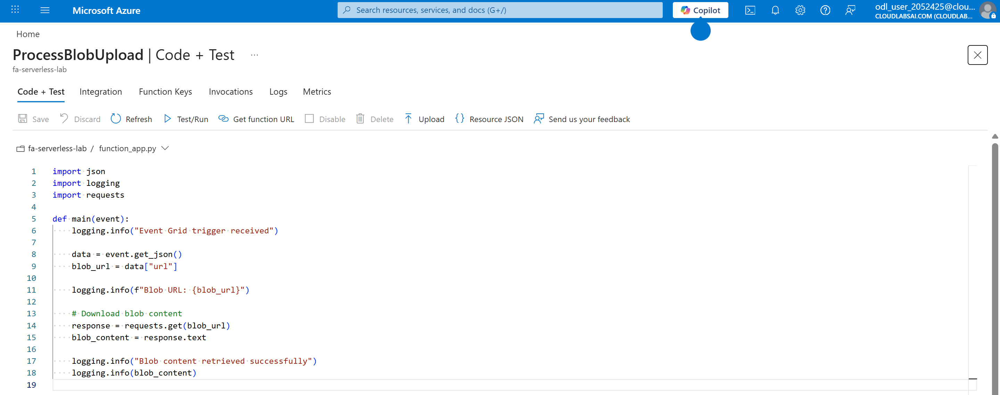
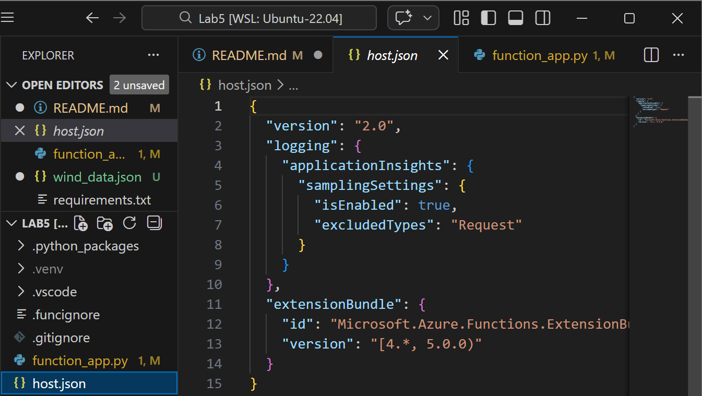
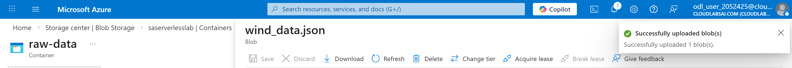
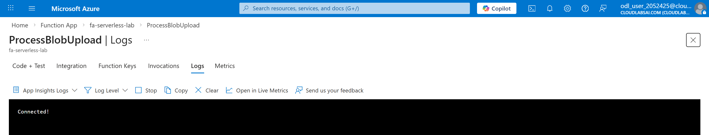
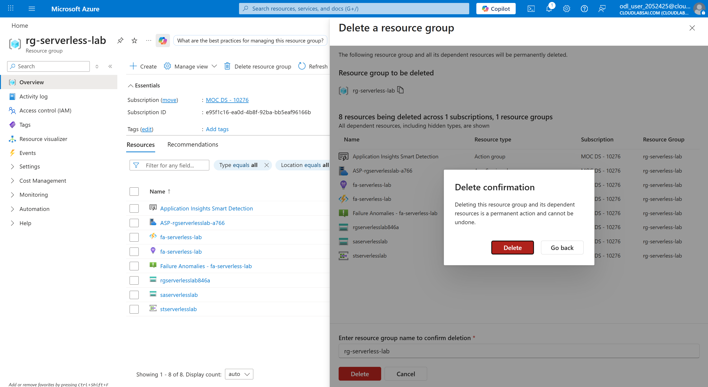

# Lab 5 – Serverless Computing
## Created Storage Account with Blob Container

## Created Function App

## Created Function and published it to Azure

## Created Event Subscription

## Updated Function Code

## Created Sample Data File

## Uploaded File

## Confirmed Function Invocation

Given that the monitor tab does not exist, I determined using AI that the logs tab with the modern equivalent to the monitor tab.

## Cleaned up resources
