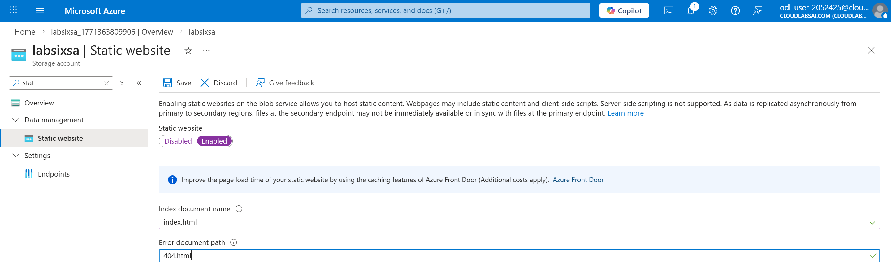
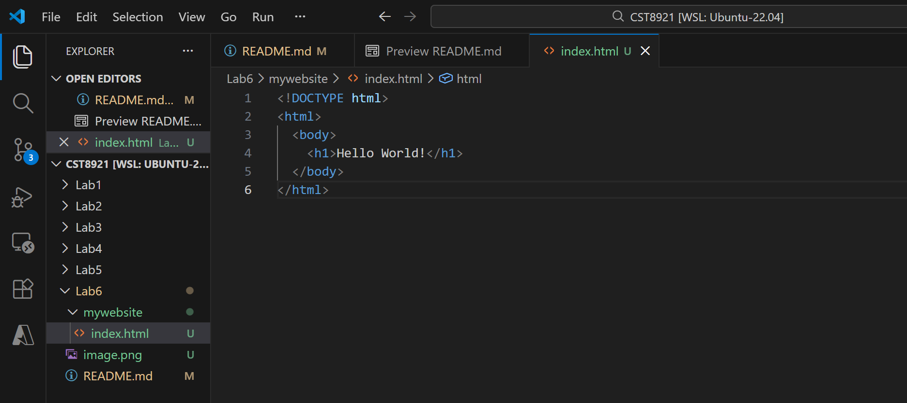
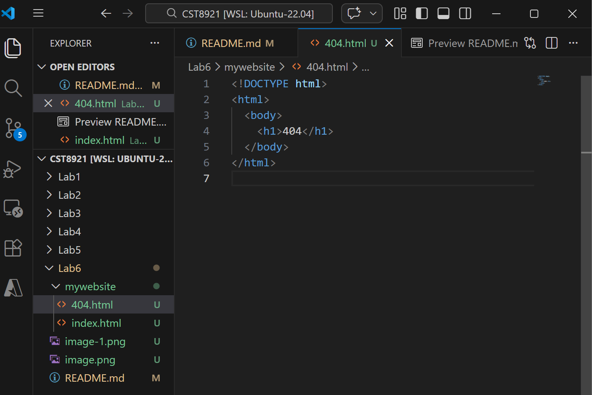
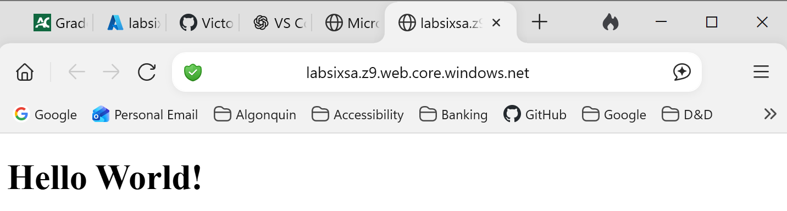
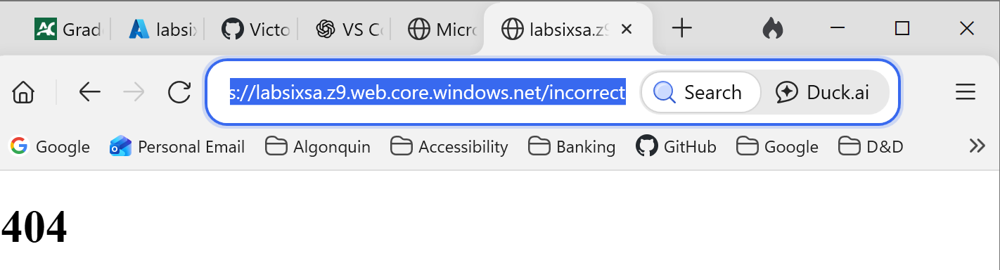

# Lab 6 – Hosting static web app on blob storage 

## Objective
The objective of the lab is to host a static web app using a storage account.

## Enable static website for storage account

## Created index.html

## Created 404.html

## Demonstrated the "Hello World" page working

## Demonstrated the 404 page when the path is incorrect
